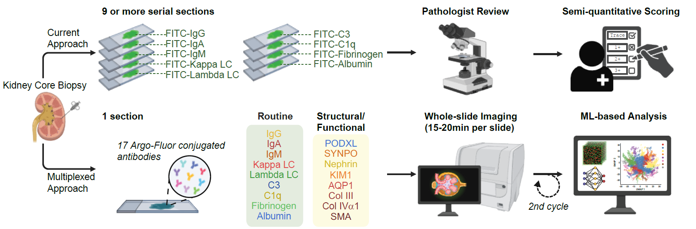

[](https://opensource.org/licenses/MIT)

# Integrated Spatial Diagnostics for Clinically Deployable, Quantitative Tissue Pathology

Jia-Yun Chen, Yu-An Chen, Jia-Ren Lin, Yilin Xu, Claire T. Avillach, Clemens B. Hug, Crystal Chiu, Sabrina Chan, Terri Woo, Helmut G. Rennke, Joseph V. Bonventre, Astrid Weins, Peter K. Sorger, Sandro Santagata



## SUMMARY

Advances in spatial multi-omic tissue atlases have revealed the molecular and architectural complexity of human disease, yet these insights remain largely inaccessible in routine diagnostics. Here, we introduce a clinically compatible spatial pathology framework that unifies one-shot multiplex immunofluorescence, multimodal computational pathology, and interactive digital interpretation within the operational constraints of standard histopathology. From a single biopsy section, this approach generates quantitative, compartment-resolved molecular maps and multimodal predictions that remain aligned with established diagnostic conventions and turnaround times. Applied to 199 consecutively collected kidney biopsies – a testbed rich in mechanistically informative biomarkers and diagnostic complexity – the framework identified disease-defining molecular signatures; quantified key processes such as complement activation, paraprotein imbalance, tubular injury, mesangial expansion, and fibrosis; and uncovered continuous spatial trajectories of progressive podocyte loss and glomerular remodeling. Integrating H&E-derived morphological embeddings with spatial molecular features markedly improved diagnostic accuracy and mechanistic interpretation compared with either modality alone. These findings demonstrate a clinically deployable architecture that incorporates rich molecular and spatial information into routine diagnostic workflows while preserving the interpretive logic of pathology. Although evaluated in kidney disease, the modular design supports rapid extension to other tissues, providing a generalizable route toward quantitative, predictive, and mechanism-informed tissue pathology.

## ACCESS THE DATA

Example images can be accessed through Harvard tissue Atlas website (https://s3.amazonaws.com/www.cycif.org/152-kidney-imaging/LSP20571/index.html). Cell count tables have been released via Github (https://github.com/labsyspharm/Chen-Santagata-Kidney-2026/). Pathology scores and Orion quantifications are on Google Sheets and referenced in the relevant scripts directly. Additional images and data will be provide upon request.

## Codes for imaging data processing

High-plex whole-slide images were acquired using tissue cyclic immunofluorescence (t-CyCIF; Lin et al, 2018) and then stitched and registered using ASHLAR (https://github.com/labsyspharm/ashlar).

## System requirements

### Hardware requirements

<mark>TODO Yu-An and Jerry: Please double check the hardware requirements below:</mark>

CyCIF image processing and analysis requires a computer with at least 200 GB of RAM and 1 TB of free disk space. A high-performance computing cluster is recommended. All other analyses can be performed on a standard desktop or laptop computer with at least 32 GB of RAM.

### Software requirements

#### OS requirements

CyCIF image processing was performed on a Linux system running RedHat Enterprise Linux 9. All other analyses are
compatible with Windows, macOS, and Linux operating systems.

#### Software packages

CyCIF image processing

- Python 3.12
    - NumPy 1.24
    - ...

Matlab code

- <mark>Matlab xxx</mark>
    - ...

Pathology score analysis and visualization

- R 4.4.2
    - here 1.0.1
    - tidybayes 3.0.7
    - ggpubr 0.6.0
    - ggbeeswarm 0.7.2
    - qs 0.27.3
    - janitor 2.2.1
    - brms 2.22.0
    - powerjoin 0.1.0
    - googlesheets4 1.1.1
    - DescTools 0.99.60
    - coin 1.4-3
    - broom.mixed 0.2.9.6
    - ordinal 2023.12-4.1
    - DT 0.33
    - forcats 1.0.0
    - stringr 1.5.2
    - dplyr 1.1.4
    - purrr 1.1.0
    - readr 2.1.5
    - tidyr 1.3.1
    - tibble 3.3.0
    - ggplot2 3.5.2
    - tidyverse 2.0.0
    - rmarkdown 2.29

## Installation guide

### Python environment

<mark>TODO</mark>

### Matlab environment

<mark>TODO</mark>

### R environment

Download and install R >4.4.2 from https://cloud.r-project.org/. Necessary R packages can be installed using the
following command in R:

```R
install.packages(c("here", "tidybayes", "ggpubr", "ggbeeswarm", "qs", "janitor", "brms", "powerjoin",
                   "googlesheets4", "DescTools", "coin", "broom.mixed", "ordinal", "DT",
                   "forcats", "stringr", "dplyr", "purrr", "readr", "tidyr", "tibble",
                   "ggplot2", "tidyverse", "rmarkdown"))
```

Expected installation time is around 15-30 minutes depending on the internet speed.

## Usage

<mark>TODO: Expand where necessary</mark>

### CyCIF image processing

Download the example image data from Harvard tissue Atlas website (https://s3.amazonaws.com/www.cycif.org/152-kidney-imaging/LSP20571/index.html) and unzip the files to a local directory. Run the scripts in the `cycif_image_processing` folder sequentially to perform image stitching, registration, segmentation, and feature extraction.

<mark>Expected runtime is around x hours.</mark>

### Pathology score analysis and visualization

Run the R script `score_comparison.rmd` using RStudio or in any R terminal using:

```R
rmarkdown::render("score_comparison.rmd")
```

This will generate the figures and tables shown in the manuscript. Expected runtime is around 30 minutes.
